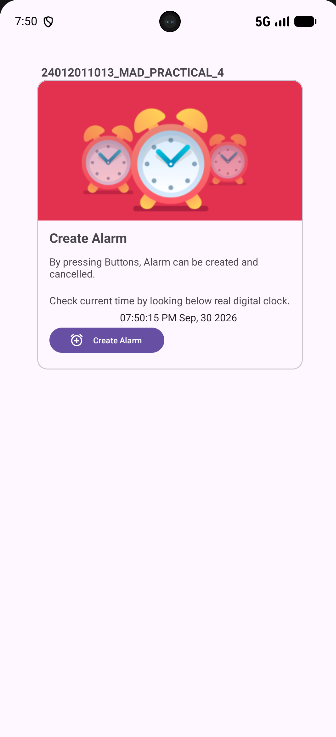
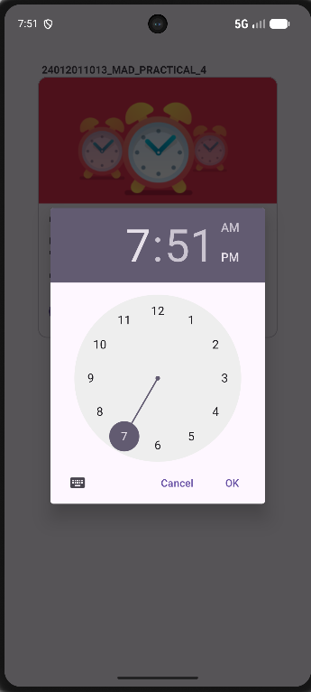
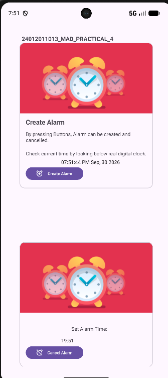
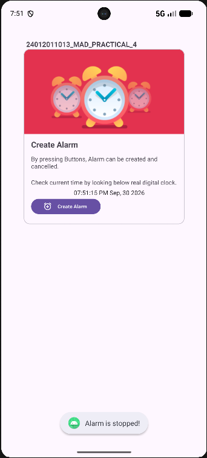

# ⏰ Practical 4 — Android Alarm using Service & BroadcastReceiver

> **Aim:** Develop an Android Alarm application in Kotlin using **AlarmManager, BroadcastReceiver and Service**.

---

## 🎯 Objective

This practical demonstrates the working of an Android alarm application. The user can select a time, schedule an alarm, view the selected alarm in the application, and cancel it when required.

The main parts of the application are:

- **MainActivity** — manages the user interface and alarm scheduling.
- **AlarmBroadcastReceiver** — receives the scheduled alarm broadcast.
- **AlarmService** — plays the alarm sound using MediaPlayer.
- **AlarmManager** — schedules the alarm at the selected time.
- **PendingIntent** — connects AlarmManager with the BroadcastReceiver.
- **TimePickerDialog** — allows the user to select the alarm time.

---

## 📂 Project Structure

```
24012011013_MAD_PRACTICAL4/
│
├── app/
│   └── src/
│       └── main/
│           ├── java/
│           │   └── com/example/
│           │       └── a24012011013_mad_practical4/
│           │           ├── MainActivity.kt
│           │           ├── AlarmBroadcastReceiver.kt
│           │           └── AlarmService.kt
│           │
│           ├── res/
│           │   ├── drawable/
│           │   ├── layout/
│           │   ├── raw/
│           │   │   └── alarm.mp3
│           │   └── values/
│           │
│           └── AndroidManifest.xml
│
├── screenshots/
├── gradle/
├── build.gradle.kts
├── gradle.properties
├── gradlew
├── gradlew.bat
├── settings.gradle.kts
└── README.md
```

---

# 🧩 Main Components

## 1. MainActivity

`MainActivity` controls the main screen and handles the alarm setup and cancellation process.

When the activity starts, it:

1. Loads the main layout.
2. Applies the system window configuration.
3. Finds the alarm card and required buttons.
4. Keeps the alarm card hidden initially.
5. Opens the time picker when the user selects **Set Alarm**.
6. Displays the selected alarm after it is scheduled.
7. Cancels the alarm when **Cancel Alarm** is pressed.

The alarm card is initially hidden using:

```kotlin
cardSetAlarm.visibility = View.GONE
```

After the alarm is successfully created, the selected time is shown in the card.

---

# 🕐 Selecting the Alarm Time

The application uses `TimePickerDialog` to select the required hour and minute.

```kotlin
val picker = TimePickerDialog(
    this,
    { tp, sHour, sMinute ->
        sendDialogDataToActivity(sHour, sMinute)
    },
    hrs,
    mns,
    false
)

picker.show()
```

The current hour and minute are used as the initial values of the time picker.

---

# 📅 Preparing the Alarm Time

After selecting the time, a `Calendar` object is created using the current date and the selected hour and minute.

```kotlin
alarmCalendar.set(year, month, day, hour, minute, 0)
```

The scheduled time is then converted into milliseconds:

```kotlin
alarmCalendar.timeInMillis
```

This value is supplied to `AlarmManager`.

---

# ⏱️ AlarmManager & PendingIntent

A broadcast `PendingIntent` is created for `AlarmBroadcastReceiver`.

```kotlin
val pendingIntent = PendingIntent.getBroadcast(
    applicationContext,
    23245,
    intent,
    PendingIntent.FLAG_IMMUTABLE
)
```

The Android `AlarmManager` is obtained using:

```kotlin
val alarmManager =
    getSystemService(ALARM_SERVICE) as AlarmManager
```

The application checks whether exact alarms can be scheduled:

```kotlin
alarmManager.canScheduleExactAlarms()
```

The alarm is then scheduled with:

```kotlin
alarmManager.setExact(
    AlarmManager.RTC_WAKEUP,
    millisTime,
    pendingIntent
)
```

---

# 🔐 Exact Alarm Permission

The application uses the following permission in the manifest:

```xml
<uses-permission
    android:name="android.permission.SCHEDULE_EXACT_ALARM" />
```

If exact alarm access is not available, the application informs the user and opens the relevant Android settings page to enable it.

---

# 📡 AlarmBroadcastReceiver

`AlarmBroadcastReceiver` extends Android's `BroadcastReceiver`.

The receiver reads the service command from the intent using:

```kotlin
SERVICE_KEY = "Service1"
```

The application uses two command values:

```kotlin
START_VAL = "start"
STOP_VAL = "stop"
```

When the receiver gets **start**, it starts `AlarmService`.

When it gets **stop**, it stops the alarm service.

### Receiver Flow

```
        Alarm Broadcast
              │
              ▼
   AlarmBroadcastReceiver
          /       \
       start      stop
        │           │
        ▼           ▼
 AlarmService    Stop Service
```

---

# 🔊 AlarmService

`AlarmService` is responsible for playing the alarm audio.

The sound file is stored in:

```
app/src/main/res/raw/alarm.mp3
```

The service uses:

```kotlin
MediaPlayer.create(this, R.raw.alarm)
```

to load the alarm sound and starts playback when the service is activated.

The MediaPlayer resources are released when the service is stopped or destroyed.

---

# 🔄 Complete Alarm Flow

```
┌─────────────────────┐
│     MainActivity    │
└──────────┬──────────┘
           │
           ▼
┌─────────────────────┐
│   TimePickerDialog  │
└──────────┬──────────┘
           │
           ▼
┌─────────────────────┐
│      Calendar       │
└──────────┬──────────┘
           │
           ▼
┌─────────────────────┐
│     AlarmManager    │
└──────────┬──────────┘
           │
           ▼
┌─────────────────────┐
│    PendingIntent    │
└──────────┬──────────┘
           │
           ▼
┌─────────────────────────┐
│ AlarmBroadcastReceiver  │
└──────────┬──────────────┘
           │
           ▼
┌─────────────────────┐
│    AlarmService     │
└──────────┬──────────┘
           │
           ▼
┌─────────────────────┐
│     MediaPlayer     │
│    Alarm Sound      │
└─────────────────────┘
```

### Working Sequence

**MainActivity → TimePickerDialog → Calendar → AlarmManager → PendingIntent → BroadcastReceiver → AlarmService → MediaPlayer**

---

# ❌ Cancelling the Alarm

The **Cancel Alarm** button cancels the previously scheduled alarm.

The PendingIntent is cancelled using:

```kotlin
alarmManager.cancel(pendingIntent)
```

The receiver is also notified so that the running alarm service can be stopped.

The alarm card is hidden again and a Toast message is displayed:

```
Alarm is stopped!
```

---

# 📚 Concepts Used

| Concept | Purpose |
|---|---|
| Activity | Provides the application interface |
| BroadcastReceiver | Receives the alarm event |
| Service | Handles alarm sound playback |
| AlarmManager | Schedules the alarm |
| PendingIntent | Delivers the scheduled broadcast |
| TimePickerDialog | Selects alarm time |
| Calendar | Creates the required date and time |
| MediaPlayer | Plays the alarm audio |
| MaterialCardView | Displays the selected alarm |
| MaterialButton | Provides Set and Cancel controls |
| Toast | Shows status messages |
| Edge-to-Edge | Supports modern screen layout |
| Exact Alarm | Schedules the alarm accurately |

---

# 🛠️ Development Steps

1. Create the Android Studio project.
2. Design the alarm screen in `activity_main.xml`.
3. Implement `MainActivity`.
4. Add the Set Alarm and Cancel Alarm controls.
5. Implement `TimePickerDialog`.
6. Store the selected time using `Calendar`.
7. Create the `PendingIntent`.
8. Obtain the `AlarmManager`.
9. Check exact alarm permission.
10. Schedule the alarm using `setExact()`.
11. Create `AlarmBroadcastReceiver`.
12. Create `AlarmService`.
13. Add the alarm audio file.
14. Configure `MediaPlayer`.
15. Implement alarm cancellation.
16. Test alarm creation, ringing and cancellation.

---

# ▶️ How to Run

1. Open the project in **Android Studio**.
2. Wait for Gradle synchronization to finish.
3. Connect an Android device or start an emulator.
4. Run the application.
5. Press **Set Alarm**.
6. Select the required time.
7. Allow exact-alarm access if Android asks for permission.
8. Wait for the selected alarm time.
9. Verify that the alarm sound starts.
10. Press **Cancel Alarm** to stop the alarm.

---

# 🖼️ Output Screenshots

The following section is reserved for the **four output screenshots** of the practical. The images can be uploaded later into the `screenshots` folder using these filenames.

### 1. Alarm Main Screen



### 2. Time Picker Dialog



### 3. Alarm Set / Alarm Card



### 4. Alarm Stopped Toast




---

# 📁 Important Files

```
MainActivity.kt
AlarmBroadcastReceiver.kt
AlarmService.kt
activity_main.xml
AndroidManifest.xml
res/raw/alarm.mp3
screenshots/practical4_output_1.webp
screenshots/practical4_output_2.webp
screenshots/practical4_output_3.webp
screenshots/practical4_output_4.webp
```

---

# ✅ Result

The Android Alarm application was successfully developed in Kotlin using **AlarmManager, PendingIntent, BroadcastReceiver and Service**. The application allows the user to select an alarm time, schedule the alarm, display the configured alarm, play the alarm sound using **MediaPlayer**, and cancel the alarm when required.

---

## 👨‍💻 Student Details

**Student Name:** Yash Chaudhary  
**Enrollment No.:** 24012011013  
**Practical:** MAD Practical 4  
**Project:** Android Alarm Application
